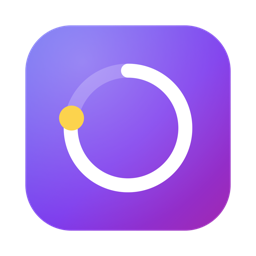
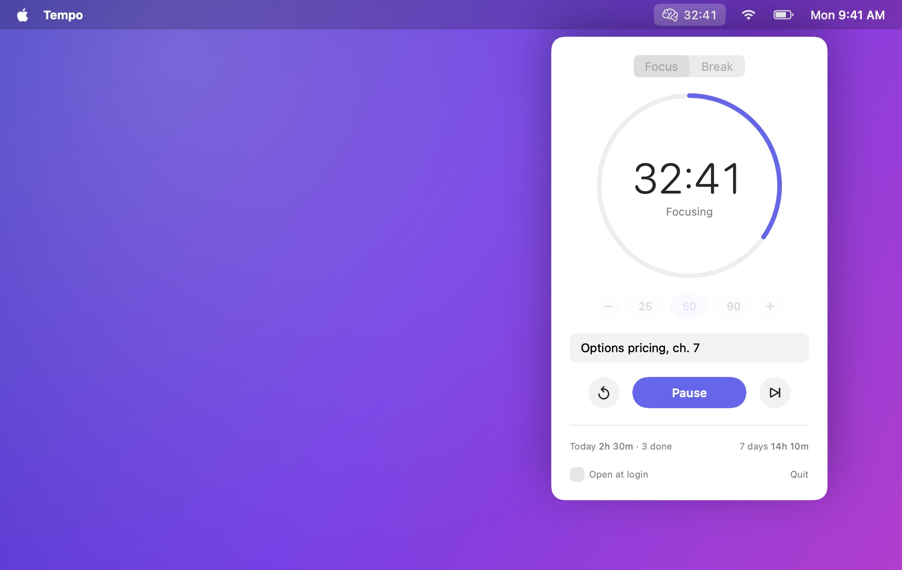
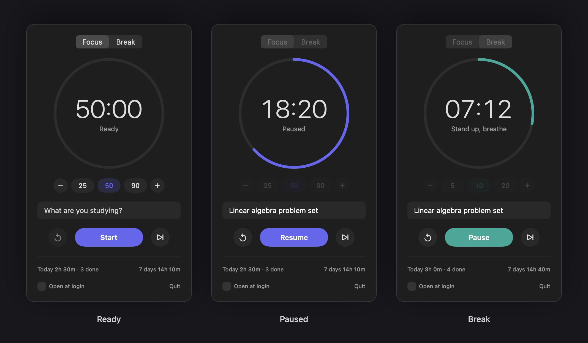
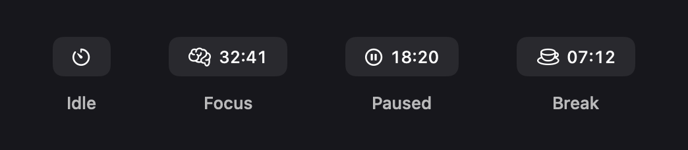

<p align="center">
  
</p>

<h1 align="center">Tempo</h1>

<p align="center">
  A minimal study timer for the macOS menu bar.<br>
  No account, no network, no ads, no analytics.
</p>

<p align="center">
  
  
  
  
</p>



## Why

Most focus timers want an account, show ads, or sync your sessions to a server you don't control.
Tempo does one job.
It counts down a study block from the menu bar and remembers how much you studied, on your Mac and nowhere else.

## Features

- **Live menu bar countdown.** The label shows the phase and the time left, in monospaced digits so it never jitters.
- **Focus and break modes.** Presets of 25, 50 and 90 minutes for focus and 5, 10 and 20 for breaks, adjustable in 5-minute steps.
- **A topic per session.** Note what you're studying and it is saved with the session.
- **Progress you can see.** Today's focused time, completed sessions and a rolling 7-day total.
- **End-of-session alert.** A chime plays even when a Focus mode silences notifications, a banner appears, and Tempo moves to the next phase.
- **Accurate.** The countdown runs against a fixed end time, so App Nap or a busy CPU can't make it drift.
- **Scriptable.** A `tempo://` URL scheme starts, pauses, resets or skips from Raycast, Alfred, Shortcuts or the terminal.
- **Light and dark.** Follows the system appearance.



### Menu bar states



| Label | Meaning |
|---|---|
| Timer | Idle. Click to open the panel. |
| Brain and time left | Focus session running |
| Pause and time left | Paused |
| Cup and time left | Break running |

## Install

Tempo is built from source on your own Mac, which takes about a minute.

### Requirements

- macOS 14 Sonoma or later, on Apple silicon or Intel
- Xcode Command Line Tools (`xcode-select --install`); the full Xcode app is not needed

### Build and install

```sh
git clone https://github.com/tanishhky/tempo.git
cd tempo
./build.sh --install
```

`build.sh` compiles the app, signs it ad hoc, copies it to `/Applications/Tempo.app` and launches it.
The timer icon appears in your menu bar.
Because the app is built locally rather than downloaded, Gatekeeper does not quarantine it.

### First launch

- macOS asks whether Tempo may send notifications. Allow it to get the end-of-session banner; the chime plays either way.
- To start Tempo with your Mac, tick **Open at login** in the panel. macOS may ask you to approve it under System Settings → General → Login Items.

### Update

```sh
cd tempo
git pull
./build.sh --install
```

### Uninstall

```sh
pkill -x Tempo
rm -rf /Applications/Tempo.app "$HOME/Library/Application Support/Tempo"
defaults delete me.tanishkyadav.tempo
```

## Usage

1. Click the timer icon in the menu bar.
2. Pick a length and, optionally, type what you're studying.
3. Press Return to start.

When the block ends, Tempo chimes, logs the session and switches to a break.
Start the break when you're ready; it hands back to focus the same way.
If you reset or skip a focus block after at least a minute, the minutes you put in still count.

| Shortcut (panel open) | Action |
|---|---|
| <kbd>Return</kbd> | Start, pause or resume |
| <kbd>⌘</kbd> <kbd>R</kbd> | Reset the current session |
| <kbd>⌘</kbd> <kbd>Q</kbd> | Quit Tempo |

## Raycast, Shortcuts and the terminal

Tempo registers the `tempo://` URL scheme, so anything that can open a URL can control it.

| URL | Action |
|---|---|
| `tempo://toggle` | Start or pause |
| `tempo://start` | Start, or resume if paused |
| `tempo://pause` | Pause |
| `tempo://reset` | Reset the current session |
| `tempo://skip` | Skip to the next phase |

From a terminal:

```sh
open tempo://toggle
```

**Global hotkey with Raycast:** run *Create Quicklink*, set the link to `tempo://toggle` and save it.
Then assign it a hotkey in Raycast Settings → Extensions.

## Your data

Everything stays on your Mac, and Tempo contains no networking code.

| What | Where |
|---|---|
| Sessions | `~/Library/Application Support/Tempo/sessions.jsonl` |
| Settings (lengths, last topic) | the `me.tanishkyadav.tempo` defaults domain |

Each session is one JSON object per line:

```json
{"completed":true,"end":"2026-10-04T21:33:20Z","minutes":50,"phase":"focus","start":"2026-10-04T20:43:20Z","topic":"Options pricing, ch. 7"}
```

JSON Lines opens in any spreadsheet tool or in `jq`.
For example, total focus minutes per topic:

```sh
jq -s 'map(select(.phase == "focus"))
       | group_by(.topic)
       | map({topic: .[0].topic, minutes: (map(.minutes) | add)})' \
  "$HOME/Library/Application Support/Tempo/sessions.jsonl"
```

## Project layout

```
Sources/
  TempoApp.swift      App entry, menu bar scene, URL and notification handling
  TimerModel.swift    Timer state, session log, stats and the menu bar label
  PanelView.swift     The SwiftUI panel
Resources/            Info.plist, AppIcon.svg and AppIcon.icns
tools/
  make-icon.sh        Rebuilds AppIcon.icns and docs/icon.png from AppIcon.svg
  screenshots.sh      Renders the images in docs/ from the real PanelView
  screenshots.swift   The renderer behind screenshots.sh
  render.swift        SVG to PNG renderer used by make-icon.sh
build.sh              Compiles and bundles Tempo.app; --install copies it to /Applications
```

There is no Xcode project and there are no dependencies.
`build.sh` calls `swiftc` directly.
