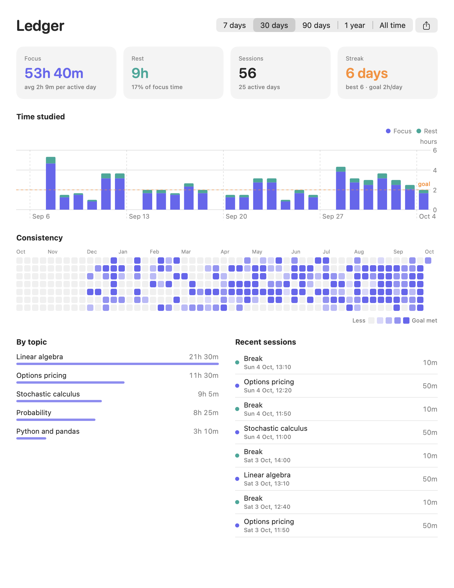
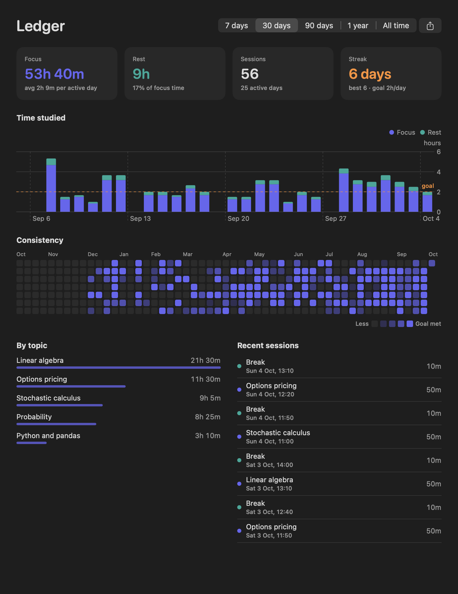
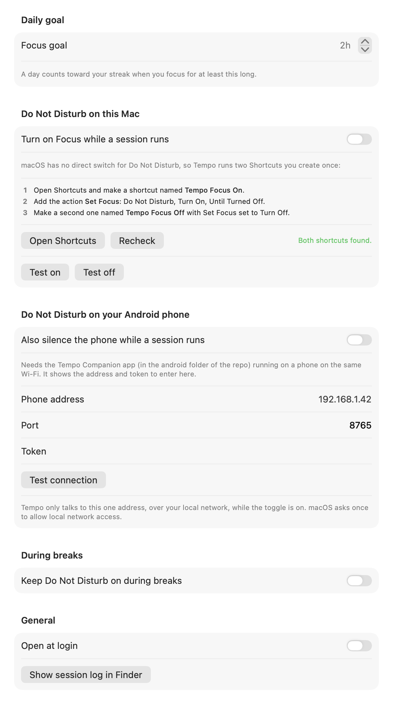

<p align="center">
  
</p>

<h1 align="center">Tempo</h1>

<p align="center">
  A minimal study timer for the macOS menu bar.<br>
  No account, no ads, no analytics, no cloud.
</p>

<p align="center">
  
  
  
  
</p>


## Why

Most focus timers want an account, show ads, or sync your sessions to a server you don't control.
Tempo counts down a study block from the menu bar, keeps a permanent ledger of everything you study, and silences your Mac and your Android phone while you work.
Your history lives in one file on your Mac and nowhere else.

## Features

- **Live menu bar countdown.** The label shows the phase and the time left, in monospaced digits so it never jitters.
- **Focus and break modes.** Presets of 25, 50 and 90 minutes for focus and 5, 10 and 20 for breaks, adjustable in 5-minute steps.
- **A permanent ledger.** Every focus block and every break, kept forever, with totals for 7 days, 30 days, 90 days, a year or all time.
- **A habit tracker.** A daily focus goal, a streak of days you hit it, and a year-long heatmap.
- **Do Not Disturb that follows the timer.** Focus on your Mac and Do Not Disturb on your Android phone switch on when a session starts and off when it ends.
- **A topic per session.** Note what you're studying and see time per topic.
- **End-of-session alert.** A chime plays even when a Focus mode silences notifications, a banner appears, and Tempo moves to the next phase.
- **Accurate.** The countdown runs against a fixed end time, so App Nap or a busy CPU can't make it drift.
- **Scriptable.** A `tempo://` URL scheme controls it from Raycast, Alfred, Shortcuts or the terminal.
- **Light and dark.** Follows the system appearance.


### Menu bar states


| Label | Meaning |
|---|---|
| Timer | Idle. Click to open the panel. |
| Brain and time left | Focus session running |
| Pause and time left | Paused |
| Cup and time left | Break running |

## The ledger and your streak

Open **Ledger** from the panel (or `tempo://ledger`) for the long view.



- **Totals** for focus time, rest time, completed sessions and active days over the range you pick.
- **Time studied** as stacked focus and rest bars per day, per week or per month depending on the range, with your daily goal as a dashed line.
- **Consistency** is a year of days, one square each, shaded by how close you got to your goal. Hover a square for that day's numbers.
- **Streak** counts consecutive days you reached your goal. Today never breaks it until the day is over.
- **By topic** and **Recent sessions** show where the time went.
- **Export** every session as CSV from the button in the corner.

Set your daily goal (default 2 hours) in **Settings**.
Rest counts too: a break you stop early still logs once it passes a minute, the same as a focus block.

<details>
<summary>Dark mode</summary>



</details>

> The ledger and heatmap images use generated sample history, not real study data.

## Do Not Disturb

Tempo switches Do Not Disturb on when a focus block starts and off when it ends, pauses, is reset or skipped, or when you quit.
It can also keep it on through breaks.
Tempo switches back whatever it switched on, including when you quit, and never touches a device you did not turn on in **Settings**.
If Tempo or the Mac crashes mid-session, the phone reverts by itself when the session's time is up; Focus on the Mac stays on until you turn it off.

### On your Mac

macOS has no public switch for Do Not Disturb, so Tempo runs two Shortcuts that you create once:

1. Open the Shortcuts app and create a shortcut named **Tempo Focus On**.
2. Add the action **Set Focus**: Do Not Disturb, Turn On, Until Turned Off.
3. Create a second shortcut named **Tempo Focus Off** with **Set Focus** set to Turn Off.
4. In Tempo's **Settings**, turn on *Turn on Focus while a session runs*. It shows whether it found both shortcuts, and has **Test on** and **Test off** buttons.

You can pick any Focus in those shortcuts, not only Do Not Disturb.

### On your Android phone

The **Tempo Companion** app in [`android/`](android) listens on your local network and switches the phone's Do Not Disturb when your Mac asks.
Everything stays between the two devices on your own Wi-Fi.



1. **Build it.** You need JDK 17 or later and the Android SDK (platform 35).

   ```sh
   cd android
   export ANDROID_HOME=/path/to/your/android-sdk
   ./gradlew assembleDebug
   ```

   The APK is `app/build/outputs/apk/debug/app-debug.apk`.
2. **Install it.** Copy the APK to the phone and open it, or run `adb install app/build/outputs/apk/debug/app-debug.apk` with the phone connected.
   Android will ask you to allow installing from your file manager or browser.
3. **Grant three permissions** on the phone's screen, each with a button that opens the right Settings page:
   - **Do Not Disturb access**, required. Android only lets an app change Do Not Disturb after you switch it on yourself.
   - **Notifications**, so Android can show the "listening" notification that background listeners must have.
   - **Unrestricted battery use**, recommended. Without it Android may delay the Mac's request while the phone sleeps.
4. **Tap Start listening.** The app shows the phone's address, the port and a token.
5. **Enter them in Tempo.** In **Settings**, turn on *Also silence the phone*, type the address, port and token, and press **Test connection**.
   The first time, macOS asks to allow Tempo to find devices on your local network. Allow it.

How it behaves:

- The phone is set to **Priority only**, so your own allowed contacts and alarms still get through, and the mode you had before is restored afterwards.
- Every request carries a secret token, and only two requests exist: read status, and switch Do Not Disturb.
- Tempo tells the phone how long the session lasts, so the phone switches itself back if the Mac never says "off" (a crash, a closed lid, a dropped connection).
- Traffic is plain HTTP on your local network. The token stops other devices on the network from using it, but it is not encrypted. Do not use this on a network you do not trust.
- Tempo only talks to the one address you enter, and only while the phone toggle is on.
- If the phone's address changes, update it in Settings. Reserving the phone's address in your router keeps it fixed.

**Status:** the phone's request handling has 11 automated tests and the Mac side has been exercised against a stand-in phone that speaks the same protocol, including a wrong token, missing Do Not Disturb access, an app that isn't running and a phone that never answers.
It has not yet been tried on a physical Android device, so treat the phone side as experimental and please report anything odd.

## Install

Tempo is built from source on your own Mac, which takes about a minute.

### Requirements

- macOS 14 Sonoma or later, on Apple silicon or Intel
- Xcode Command Line Tools (`xcode-select --install`); the full Xcode app is not needed

### Build and install

```sh
git clone https://github.com/tanishhky/tempo.git
cd tempo
./build.sh --install
```

`build.sh` compiles the app, signs it ad hoc, copies it to `/Applications/Tempo.app` and launches it.
The timer icon appears in your menu bar.
Because the app is built locally rather than downloaded, Gatekeeper does not quarantine it.

### First launch

- macOS asks whether Tempo may send notifications. Allow it to get the end-of-session banner; the chime plays either way.
- If you use the Android companion, macOS also asks once for local network access.
- To start Tempo with your Mac, tick **Open at login** in the panel. macOS may ask you to approve it under System Settings → General → Login Items.

### Update

```sh
cd tempo
git pull
./build.sh --install
```

### Uninstall

```sh
pkill -x Tempo
rm -rf /Applications/Tempo.app "$HOME/Library/Application Support/Tempo"
defaults delete me.tanishkyadav.tempo
```

## Usage

1. Click the timer icon in the menu bar.
2. Pick a length and, optionally, type what you're studying.
3. Press Return to start.

When the block ends, Tempo chimes, logs the session and switches to a break.
If Do Not Disturb is set up, it was on for the whole block and is off again now.
Start the break when you're ready; it hands back to focus the same way.
If you reset or skip a focus block after at least a minute, the minutes you put in still count.

| Shortcut (panel open) | Action |
|---|---|
| <kbd>Return</kbd> | Start, pause or resume |
| <kbd>⌘</kbd> <kbd>R</kbd> | Reset the current session |
| <kbd>⌘</kbd> <kbd>Q</kbd> | Quit Tempo |

## Raycast, Shortcuts and the terminal

Tempo registers the `tempo://` URL scheme, so anything that can open a URL can control it.

| URL | Action |
|---|---|
| `tempo://toggle` | Start or pause |
| `tempo://start` | Start, or resume if paused |
| `tempo://pause` | Pause |
| `tempo://reset` | Reset the current session |
| `tempo://skip` | Skip to the next phase |
| `tempo://ledger` | Open the ledger |
| `tempo://settings` | Open Settings |

From a terminal:

```sh
open tempo://toggle
```

**Global hotkey with Raycast:** run *Create Quicklink*, set the link to `tempo://toggle` and save it.
Then assign it a hotkey in Raycast Settings → Extensions.

## Your data

Everything stays on your Mac.
The only network use is the optional phone feature above: a request to the one phone address you enter, while its toggle is on.
Tempo has no accounts, analytics, update checks or servers of its own.

| What | Where |
|---|---|
| Sessions | `~/Library/Application Support/Tempo/sessions.jsonl` |
| Settings (lengths, goal, phone address and token) | the `me.tanishkyadav.tempo` defaults domain |

The ledger is built from this one file, so it is also your backup: copy it and you have your whole history.
Each session, focus or rest, is one JSON object per line:

```json
{"completed":true,"end":"2026-10-04T21:33:20Z","minutes":50,"phase":"focus","start":"2026-10-04T20:43:20Z","topic":"Options pricing, ch. 7"}
```

JSON Lines opens in any spreadsheet tool or in `jq`.
For example, total focus minutes per topic:

```sh
jq -s 'map(select(.phase == "focus"))
       | group_by(.topic)
       | map({topic: .[0].topic, minutes: (map(.minutes) | add)})' \
  "$HOME/Library/Application Support/Tempo/sessions.jsonl"
```

## Project layout

```
Sources/
  TempoApp.swift      App entry, menu bar and window scenes, URL and notification handling
  TimerModel.swift    Timer state and the menu bar label
  SessionStore.swift  The session log and the ledger maths (totals, streaks, topics)
  FocusBridge.swift   Do Not Disturb for the Mac (Shortcuts) and the phone (HTTP)
  AppSettings.swift   Stored settings
  PanelView.swift     The menu bar panel
  LedgerView.swift    The ledger window, chart and heatmap
  SettingsView.swift  The settings window
  Theme.swift         Colours
Resources/            Info.plist, AppIcon.svg and AppIcon.icns
android/              Tempo Companion, the Android app (Kotlin, no dependencies) and its tests
tools/
  make-icon.sh        Rebuilds AppIcon.icns and docs/icon.png from AppIcon.svg
  screenshots.sh      Renders the images in docs/ from the real views and sample data
build.sh              Compiles and bundles Tempo.app; --install copies it to /Applications
```

There is no Xcode project and there are no dependencies.
`build.sh` calls `swiftc` directly, and the Mac app builds with the Command Line Tools alone.
Run the phone app's tests with `cd android && ./gradlew testDebugUnitTest`.
